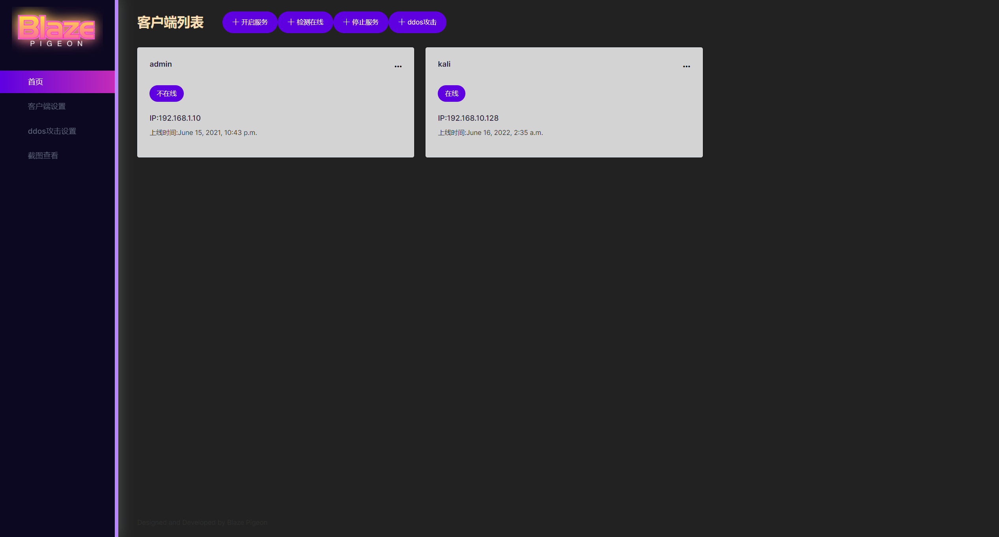
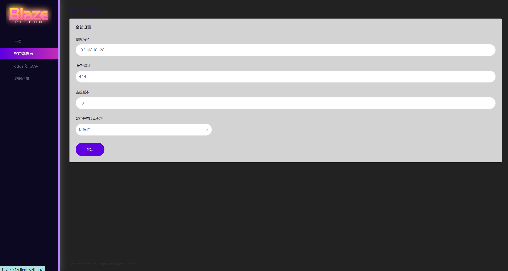
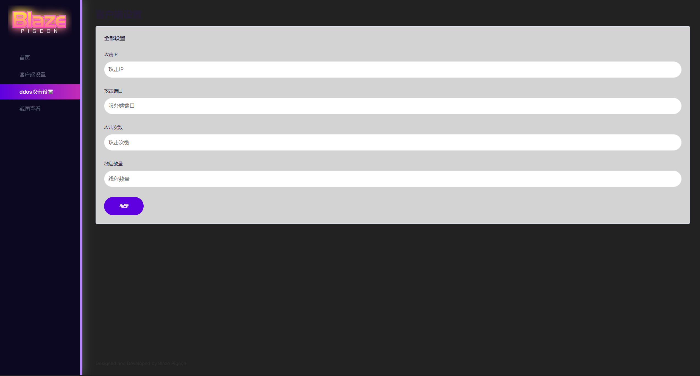

# BlazePigeon

## 介绍
BlazePigeon是一款的群控框架，使用python打造的僵尸网络，有web控制面板，可以在web端控制肉鸡。


## 安裝教程
```shell
pip install mysql

pip install lxml

pip install pywin32api

pip install requests
```

## 使用說明
- 进入BlazePigeon文件夹，启动web服务

```shell
python manage.py runserver 80 
```

- 打开http://127.0.0.1/client_setting/ ，设置客户端连接地址端口版本号
- 打开server.py  python server.py，进入之后设置ip 和 port

```shell
set lhost xxxx

set lport xxxx 
```

- 使用exploit命令 进行监听客户端
- 使用sessions命令 进行查看当前在线肉鸡数 
- 使用 shell 命令 控制肉鸡shell 
- 使用 exit 命令 推出程序

## 展示

- Login


- Home



- Client Setting



- DDos Setting



- Screen Shoot